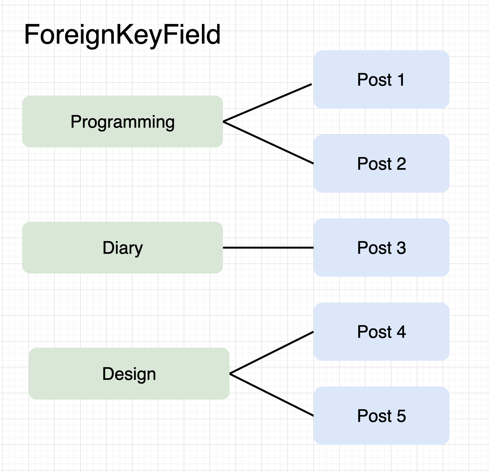

# django Tutorial #6

## Project URL

https://github.com/shun-rec/django-website-06

## ORM (Object-Relational Mapping)


## Create models

* Post
* Tag
* Category


### ForeignKey (1 : M)



### ManyToMany (M : M)


### `blog/models.py`

```py
from django.db import models


class Category(models.Model):
    name = models.CharField(
        max_length=255,
        blank=False,
        null=False,
        unique=True)
    
    def __str__(self):
        return self.name


class Tag(models.Model):
    name = models.CharField(
        max_length=255,
        blank=False,
        null=False,
        unique=True)
    
    def __str__(self):
        return self.name


class Post(models.Model):
    created = models.DateTimeField(
        auto_now_add=True,
        editable=False,
        blank=False,
        null=False)
    
    updated = models.DateTimeField(
        auto_now=True,
        editable=False,
        blank=False,
        null=False)
        
    title = models.CharField(
        max_length=255,
        blank=False,
        null=False)
        
    body = models.TextField(
        blank=True,
        null=False)
        
    category = models.ForeignKey(
        Category,
        on_delete=models.CASCADE)
        
    tags = models.ManyToManyField(
        Tag,
        blank=True)

    def __str__(self):
        return self.title
```

## Update DB

### Create migration file

```sh
python manage.py makemigrations blog
```

### Migrate DB

```sh
python manage.py migrate
```

## Use models

### django shell

#### Start

```sh
python manage.py shell
```

#### Stop

```sh
exit
```

### Operations

#### Import all models (Post, Category, Tag)

```py
from blog.models import *
```

#### Get all

```py
Post.objects.all()
```

#### Get one or nothing

```py
Post.objects.first()
```

#### Create new & save

```py
category = Category.objects.create(name="cat 1")
```

#### Create new (not save)

```py
post = Post()
```

#### Set field

```py
post.title = "post 1"
post.body = "body 1"
post.category = category
```

#### Set ManyToMany field

```py
tag1 = Tag.objects.create(name="tag 1")
tag2 = Tag.objects.create(name="tag 2")
post.tags.add(tag1)
```

#### Save it on DB

```py
post.save()
```

#### Get all

```py
Post.objects.all()
```

#### Search & Get one

```py
Category.objects.filter(name="cat 1").first()
```

#### Get all ManyToMany

```py
post.tags.all()
```

## Use models from Admin page

#### Register models

```py
from django.contrib import admin
from . import models


@admin.register(models.Category)
class CategoryAdmin(admin.ModelAdmin):
    pass


@admin.register(models.Tag)
class TagAdmin(admin.ModelAdmin):
    pass


@admin.register(models.Post)
class PostAdmin(admin.ModelAdmin):
    pass
```

#### Create Superuser

```sh
python manage.py createsuperuser
```

#### Run Server

```sh
python manage.py runserver
```

Open browser.