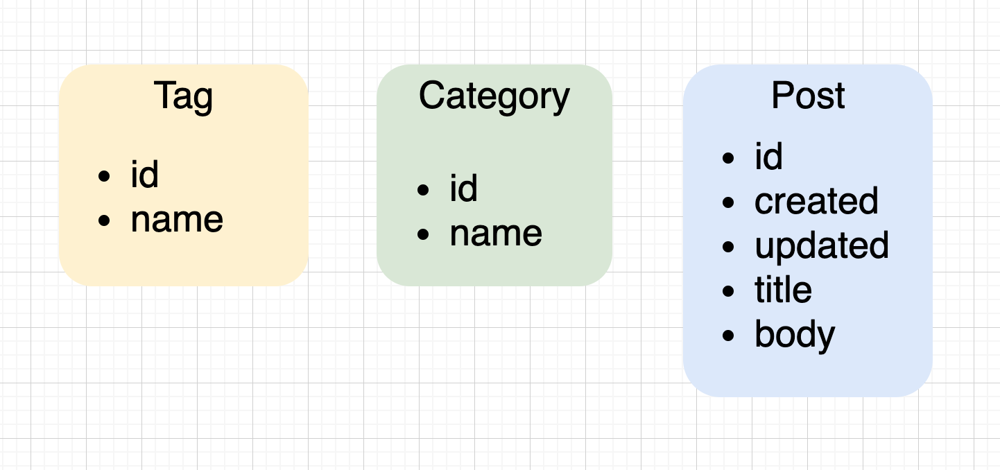
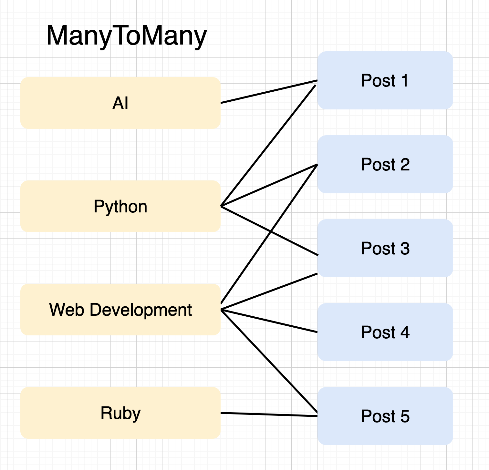

# django Tutorial #6

## Project URL

https://github.com/shun-rec/django-website-06

## Create models

* Post
* Tag
* Category



### ForeignKey (1 : M)


### ManyToMany (M : M)



### `blog/models.py`

```py
from django.db import models

class Category(models.Model):
    name = models.CharField(max_length=255, blank=False, null=False, unique=True)
    
    def __str__(self):
        return self.name


class Tag(models.Model):
    name = models.CharField(max_length=255, blank=False, null=False, unique=True)
    
    def __str__(self):
        return self.name


class Post(models.Model):
    created = models.DateTimeField(auto_now_add=True, editable=False, blank=False, null=False)
    updated = models.DateTimeField(auto_now=True, editable=False, blank=False, null=False)
    title = models.CharField(max_length=255, blank=False, null=False)
    body = models.TextField(blank=True, null=False)
    category = models.ForeignKey(Category, on_delete=models.CASCADE)
    tags = models.ManyToManyField(Tag, blank=True)

    def get_absolute_url(self):
        return reverse_lazy("detail", args=[self.id])
```

## Use models

### django shell

#### Start

```sh
python manage.py shell
```

#### Stop

```sh
exit
```

### Operations

#### Get all

```py
Post.objects.all()
```

#### Get one or nothing

```py
Post.objects.first()
```

#### Create new

```py
post = Post()
```

#### Set field

```py
post.title = "post 1"
```

#### Save it to DB

```py
post.save()
```

